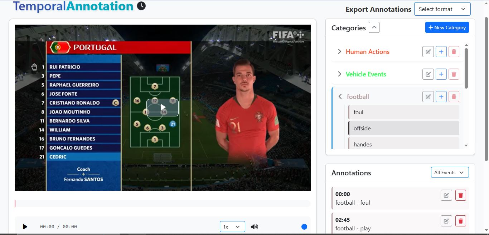

# Temporal Annotation Tool

A web-based tool for temporal annotation of videos. This tool allows users to create custom categories with events and add timestamped annotations to videos.



## Features

- Video upload and playback
- Custom category and event management
- Temporal annotation with custom fields
- Annotation filtering by event type
- Video timeline markers
- Keyboard shortcuts for efficient annotation

## Installation

### Prerequisites
- Python 3.x
- Flask
- Modern web browser

### Setup
1. Clone the repository:
```bash
git clone https://github.com/neleSuffo/TAAT
cd temporal-annotation-tool
```

2. Install dependencies:
```bash
pip install -r requirements.txt
```
4. Run the application:
```bash
python app.py
```

## Usage

### Video Upload
- Place your video files in the `uploads` folder. The application will process these files when uploaded through the web interface.

### Category Setup
1. Click "New Category" to create a category
2. Add a category name and color
3. Create events within the category
4. Add custom fields to events if needed

### Video Annotation
1. Select a category from the categories panel
2. Upload a video file
3. Select an event type
4. Use keyboard shortcuts or buttons to add annotations:
   - Enter: Add annotation
   - Space: Play/Pause
   - Left/Right arrows: Seek 10 seconds

### Managing Annotations
- Filter annotations by event type
- Edit or delete existing annotations
- Click on timeline markers to jump to specific annotations

### Annotation File Structure
- The annotation files are stored in JSON format in the `Corresponding Category` folder. Each file corresponds to a video and contains the following structure:
  ```json
  {
      "video_name": "example_video.mp4",
      "category_id": "example_category",
      "annotations": [
          {
              "time": 120,
              "categoryId": "example_category",
              "eventId": "example_event",
              "fields": {
                  "custom_field_1": "value",
                  "custom_field_2": "value"
              }
          }
      ]
  }
  ```

### Event Types and Categories
- Event types can be configured in the `config/annotation_types.json` file. You can add, edit, or remove event types as needed.

## Project Structure
```
project/
├── static/
│   ├── css/
│   └── js/
├── templates/
├── uploads/
├── app.py
├── config/
├── categories/

```
### Category Folder Structure
- Each category will have its own folder within the `categories` directory. The structure will look like this:
```
categories/
├── example_category/
│   ├── example_video.mp4.json  # Annotation file for the video
│   └── config.json              # Configuration file for the category (id ,color, events)
```

### Event Types and Categories
- Event types can be configured in the `config/annotation_types.json` file. You can add, edit, or remove event types as needed.


## Development
- Frontend: HTML, CSS, JavaScript, jQuery
- Backend: Python Flask
- Video Player: Video.js

## Troubleshooting
- If you encounter issues, ensure that all required directories exist and that you have the necessary permissions to read/write files in those directories.


